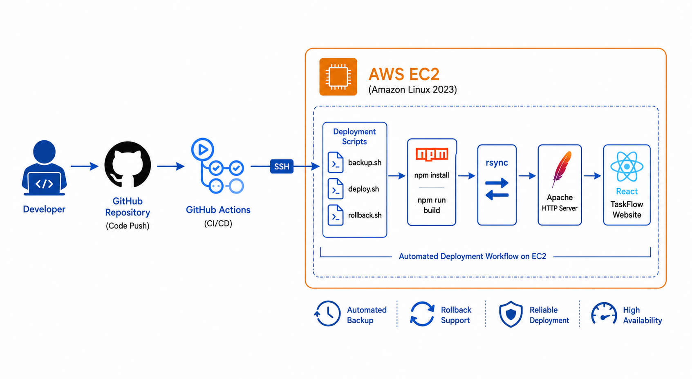
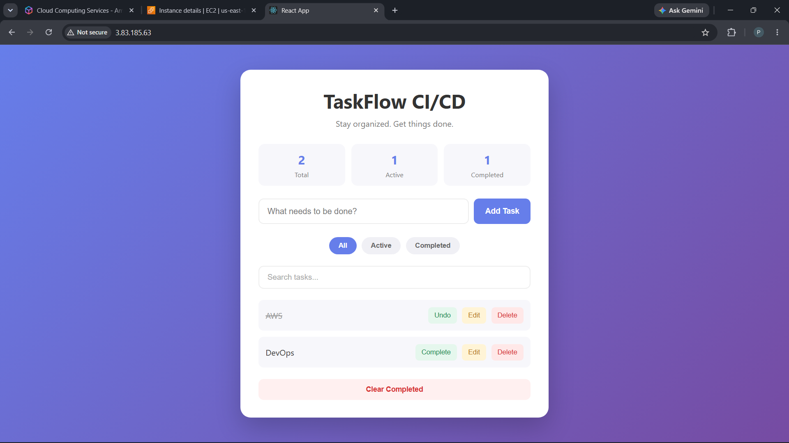
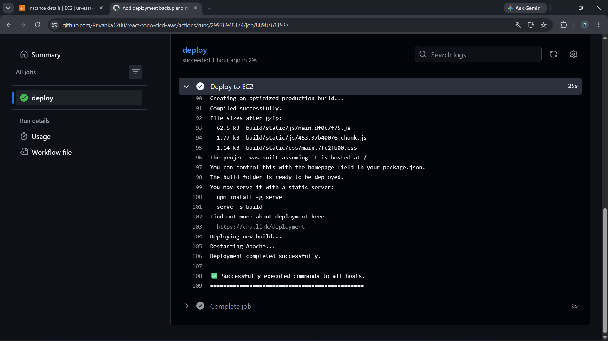
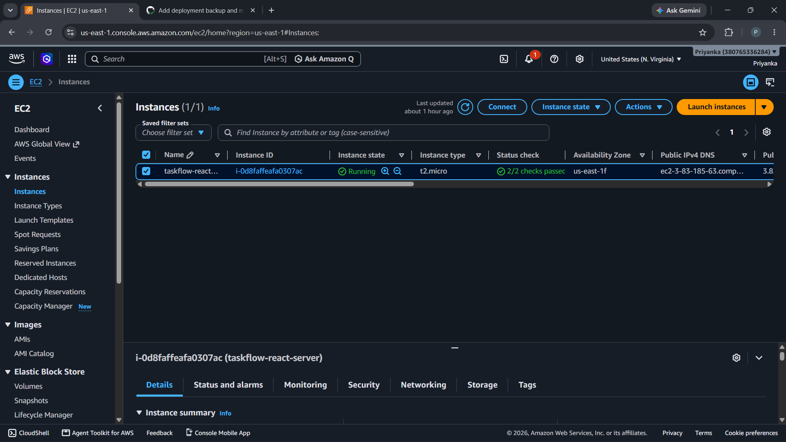
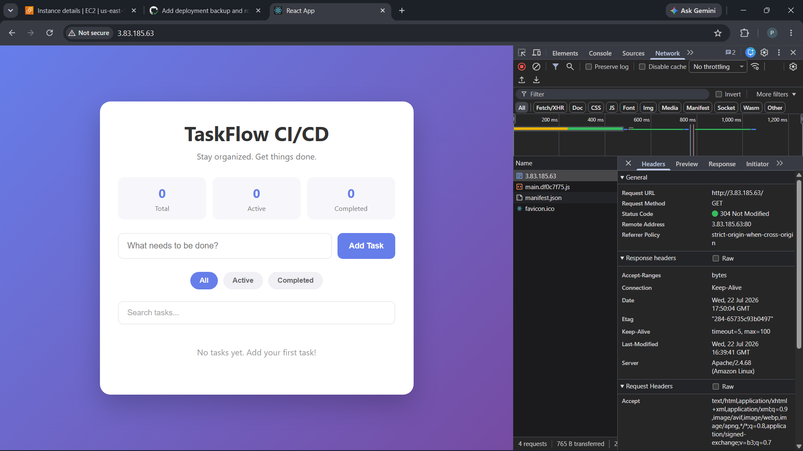
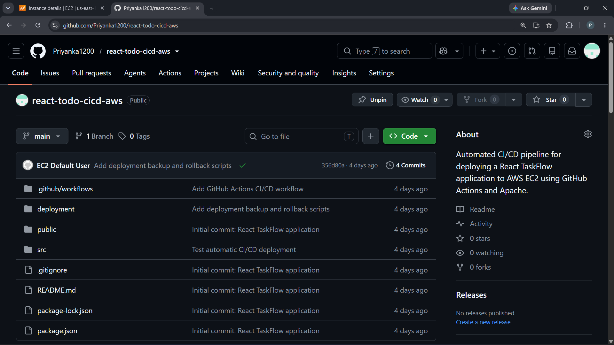

# 🚀 TaskFlow - React CI/CD Deployment on AWS EC2

> Production-ready React application deployed on AWS EC2 with Apache, GitHub Actions CI/CD, Automated Backup & Rollback.

## ⭐ Highlights

- Fully Automated CI/CD Pipeline using GitHub Actions
- React Application hosted on AWS EC2
- Apache HTTP Server Deployment
- Automated Backup before every deployment
- Automatic Rollback on deployment failure
- rsync-based deployment for efficient synchronization
- Zero manual deployment after Git push

## 🎯 Key Achievements

- Successfully deployed a React application on AWS EC2
- Implemented end-to-end CI/CD using GitHub Actions
- Built Bash automation scripts for deployment
- Implemented automated backup and rollback mechanism
- Configured Apache HTTP Server for production deployment
- Used rsync for efficient deployment synchronization
- Reduced manual deployment effort through automation

## 📌 Project Overview

TaskFlow is a React-based task management application deployed on AWS EC2 using Apache HTTP Server. The project demonstrates a complete DevOps workflow with GitHub Actions CI/CD, automated deployment, backup, and rollback.

The project includes:

- Automated CI/CD deployment
- AWS EC2 hosting
- Apache Web Server
- GitHub Actions
- Automated Backup
- Automatic Rollback
- rsync-based deployment
- Zero manual deployment after Git push

## 🛠️ Tech Stack

- React.js
- JavaScript
- HTML5
- CSS3
- AWS EC2
- Amazon Linux 2023
- Apache HTTP Server
- Git
- GitHub
- GitHub Actions
- Bash Scripting
- rsync

## ✨ Features

- React Task Management Application
- Responsive UI
- Local Storage Support
- GitHub Actions CI/CD
- AWS EC2 Deployment
- Apache Web Server
- Automated Deployment
- Automated Backup
- Automatic Rollback on Deployment Failure
- rsync-based File Synchronization

## 🏗️ Architecture



For a detailed explanation, see:

[📄 Architecture Documentation](architecture/architecture.md)

## 📂 Project Structure

```
todo-app/
├── .github/
│   └── workflows/
│       └── deploy.yml
├── deployment/
│   ├── backup.sh
│   ├── deploy.sh
│   └── rollback.sh
├── public/
├── src/
├── package.json
└── README.md
```

## ⚙️ CI/CD Workflow

```
Developer
    │
    ▼
Git Push
    │
    ▼
GitHub Repository
    │
    ▼
GitHub Actions
    │
    ▼
SSH to AWS EC2
    │
    ▼
Backup Current Version
    │
    ▼
Git Pull
    │
    ▼
npm install
    │
    ▼
npm run build
    │
    ▼
rsync Deployment
    │
    ▼
Apache Restart
    │
    ▼
Live Website
```

## 🔄 Backup & Rollback

### Backup

- Automatic backup before every deployment
- Timestamp-based backup folders
- rsync-based synchronization

### Rollback

- Automatic rollback on deployment failure
- Latest backup restoration
- Apache automatic restart after rollback

## 🚀 Deployment Steps

1. Push code to GitHub
2. GitHub Actions triggers automatically
3. Connects to AWS EC2 via SSH
4. Creates backup
5. Pulls latest code
6. Installs dependencies
7. Builds React application
8. Deploys using rsync
9. Restarts Apache
10. Live website updated automatically

## 📸 Screenshots

### Application



### GitHub Actions CI/CD



### AWS EC2 Instance



### Apache Deployment



### Repository Structure



## 🚀 Future Enhancements

## 🚀 Future Enhancements

- Docker Containerization
- Nginx + HTTPS 
- Terraform Infrastructure as Code

